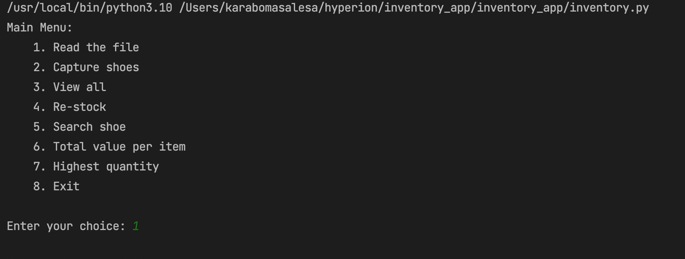

# Inventory App

A simple inventory management system that allows users to keep track of their products and manage their inventory.

## Table of Contents
- [Description](#description)
- [Installation](#installation)
- [Usage](#usage)
- [Credits](#credits)
- [Repository](#repository)

## Description

This app allows users to easily add new products, remove existing products, view the current inventory, and update product information. It is a user-friendly solution for small businesses and individuals to manage their inventory.

## Installation

1. Open the terminal or powershell on your computer

2. Navigate to the directory into which you'd like to clone the repo 

3. Clone the repository

git clone https://github.com/yourusername/inventory_app.git 

4. Use the cd command to navigate to the directory where the inventory.py file is located. For example, if the file is located in the Desktop/inventory_app directory, you would enter the following command:

cd Desktop/inventory_app

4. Run the follwing command:

python3 inventory.py

Note: The command python inventory.py or python3 inventory.py assumes that you have Python 3 installed on your computer. If you don't have Python 3 installed, you can download it from the official website.

## Usage

1. After launching the app, the main menu will appear. 
2. Select the appropriate option from the menu to add, remove, or update products.
3. You can also view the current inventory by selecting the "View Inventory" option from the menu.

## Credits

- Author: Karabo Masalesa - [My Github link](https://github.com/Kaaribu)

## Repository

https://github.com/Kaaribu/inventory_app
